# 🏏 Zenith XI — Cricket Time-Warp Simulator

> Draft a legendary IPL squad across 19 seasons of history (2007–2026), then watch them battle 10 real franchises through a full statistically-simulated IPL season and playoffs.

Zenith XI is a browser-based cricket strategy game that combines a **roguelike gacha draft mechanic** with a **data-science-driven player rating system** and a **probabilistic match simulation engine**. Every player's rating is derived from real historical IPL performance data, and every simulated match outcome is grounded in a calibrated statistical model — not scripted or hardcoded results.

---

## ✨ Features

- 🎰 **"Time Spin" Draft Mechanic** — spin through random team/season combinations from IPL history and draft an 11-man squad under real roster constraints (max 4 overseas players, strict batting-order slotting).
- 📊 **FIFA-Style Player Ratings** — every one of 2,800+ historical player-seasons has a 60–90 OVR rating, computed from real batting/bowling stats via a statistically rigorous pipeline (see below).
- 🏆 **Full Season Simulation** — your squad plays a genuine 20-match double round-robin against 10 CPU-controlled 2026 franchises, complete with a live points table, cumulative Net Run Rate, and tie-break logic.
- 🥊 **Page Playoff System** — Qualifier 1, Eliminator, Qualifier 2, and the Grand Final, exactly matching the real IPL knockout structure.
- 🎲 **Believable Upsets, Not Coin Flips** — match outcomes are driven by a variance-calibrated probabilistic engine, verified via Monte Carlo simulation to avoid both "boringly deterministic" and "pure random" extremes.

---

## 🛠 Tech Stack

<p>
  
  
  
  
  
  
  
  
  
</p>

### Frontend / Runtime

| Technology | Role in this project |
|---|---|
| **React 18** | Component-driven UI and the core application state machine (Draft → Simulation → Summary) |
| **Vite** | Dev server + build tooling — chosen over CRA for fast HMR during iterative UI development |
| **JavaScript (ES6+)** | No TypeScript in this version — a deliberate trade-off for build speed over compile-time type safety (see Roadmap) |
| **Tailwind CSS** | Utility-first styling powering the dark sports-broadcast theme and FIFA-style tiered card gradients |
| **Lucide React** | Icon set (`Dices`, `Trophy`, `Shield`, `Play`, `FastForward`, etc.) used throughout the draft room and simulation hub |

### Data Science / Offline Pipeline

| Technology | Role in this project |
|---|---|
| **Python 3** | Runs entirely offline — never shipped to the client |
| **Pandas** | Ingests and reshapes raw historical ball-by-ball IPL data into per-season player records |
| **NumPy** | Vectorized math for shrinkage calculations and score normalization |
| **SciPy (`scipy.stats`)** | Powers the **Beta distribution** inverse-CDF scarcity mapping and skewness/percentile validation |
| **scikit-learn** | Used during development/validation to regression-test OVR against raw stats (R² check) — not a runtime dependency |

### Data & Deployment

| Layer | Choice | Why |
|---|---|---|
| **Data transport** | Static JSON (`player_ratings_advanced.json`) | Precomputing offline means zero runtime compute cost for rating logic — the client just reads numbers |
| **Hosting model** | Zero-backend, fully static | The entire game — draft, simulation, standings — runs client-side; deployable to any static host (Vercel, Netlify, GitHub Pages) with no server |
| **State management** | React's built-in `useState`/`useReducer` | No Redux/Zustand — the state graph (3 view modes, roster array, standings table) is small enough that built-in state is the simpler, more maintainable choice |

---

## 🏗 Architecture

```mermaid
flowchart LR
    subgraph Offline["📊 Offline Data Pipeline — Python"]
        direction TB
        A[Raw historical<br/>ball-by-ball IPL data] --> B[Bayesian Shrinkage]
        B --> C[Season-Relative<br/>Z-Score Normalization]
        C --> D[Involvement-Weighted<br/>Role Blending]
        D --> E[Beta-CDF<br/>Scarcity Mapping]
    end

    E -->|"static JSON export"| F

    subgraph Runtime["⚛️ React Runtime Engine — Vite"]
        direction TB
        F[player_ratings_advanced.json] --> G[Draft Room<br/>State Machine]
        G --> H[Simulation Engine]
        H --> I[Live Standings<br/>+ Cumulative NRR]
        I --> J[Page Playoff<br/>Bracket]
    end
```



The pipeline runs **once, offline**, and produces a static JSON file. The React app has no backend — every runtime interaction (drafting, simulation, standings, playoffs) happens entirely client-side against that static dataset.

---

## 📈 The Data Layer — Player OVR System

Every player-season rating is built through four stages, each specifically designed to fix a known failure mode of naive stat-based ratings:

### 1. Denominator-Corrected Bayesian Shrinkage
Small samples (a 2-match cameo, a 6-over bowling spell) are pulled toward that season's league average, weighted by actual opportunity volume:
- Batting average shrinks against **times dismissed**
- Strike rate shrinks against **balls faced**
- Bowling average shrinks against **wickets taken**
- Economy rate shrinks against **overs bowled**

This prevents a 3-ball cameo at an inflated strike rate from outscoring a genuine full-season contribution.

### 2. Season-Relative Z-Score Normalization
Every stat is compared **only against that season's peers**, not against 19 years of raw numbers. This corrects for era inflation — T20 league-average strike rates and economy rates have shifted significantly since 2008, so a given raw number means something different in 2008 vs. 2026.

### 3. Involvement-Weighted Role Blending
All-rounders are scored using a data-driven blend of batting and bowling sub-scores, weighted by **actual balls faced vs. balls bowled that season** — not a fixed role label — so genuine all-rounders are never systematically under- or over-valued relative to specialists.

### 4. Beta-Distribution Scarcity Mapping
The final score is mapped onto the 60–90 scale using a **Beta(2.5, 5.0)** inverse-CDF transform, stretched against its own 99.9th percentile so the ceiling is genuinely rare:

```
OVR = 60 + 30 × clip( raw_score / Beta.ppf(0.999, 2.5, 5.0), 0, 1 )
```

**Verified output statistics** (2,803 player-seasons, 2007/08–2026):

| Metric | Value |
|---|---|
| Distribution skewness | **+0.43** (right-skewed, as intended) |
| Modal (densest) OVR bucket | **69–74** |
| Players rated ≥ 85 OVR | **2.28%** (64 players — genuinely rare) |
| Model fit (R², OVR vs. real batting/bowling stats) | **0.91** (batters) / **0.91** (bowlers) |
| Role parity (mean OVR) | Batter 71.6 · Bowler 71.6 · All-Rounder 74.9 |

---

## 🎴 The Draft Room

- **The "Time Spin"**: selects a random historical team + season, then surfaces 4 shuffled player options from that squad's actual roster.
- **Slot-based roster**: 11 tactical slots — 2 Openers, No. 3, 2 Middle-Order, Wicketkeeper, All-Rounder, Flex All-Rounder/Bowler, 2 Pace/Spin, 1 Bowler (Any).
- **Overseas cap**: max 4 overseas-tagged players; once hit, remaining overseas options are locked.
- **Overseas dead-end fallback**: if a team/season's remaining options are all overseas players and the cap is already hit, the draft pool falls back to the global domestic player pool rather than soft-locking the game.
- **Duplicate protection**: a player can't be drafted twice into the same XI.

---

## 🎮 The Simulation Engine

Match outcomes are generated from real team ratings **plus calibrated variance**, so a stronger team wins more often — but never automatically.

**Team Power Indices**
```
BattingIndex = weighted average OVR of batting order 1–7 (top order weighted highest)
BowlingIndex = mean OVR of the 4–5 specialist bowlers
TeamOVR      = mean OVR across all 11 players
```

**Score Generation**
```
ExpectedScore_A = 165 (par) + α × (BattingIndex_A − BowlingIndex_B)
ActualScore_A   = clip( Normal(ExpectedScore_A, σ × ExpectedScore_A), 60, 260 )
```

**Calibrated constants** — tuned via Monte Carlo simulation across thousands of virtual seasons, not guessed:

| | Naive first draft | **Shipped, verified values** |
|---|---|---|
| α (runs per OVR-point gap) | 1.8 | **0.9** |
| σ (variance, % of expected score) | 0.15 | **0.19** |
| Result: win rate, 21-pt OVR gap | 98.5% (too deterministic) | **~76–84%** |
| Result: title rate, dominant team | 78% of seasons (too deterministic) | **~45–52%** |

**Season format**: 11 teams (Zenith XI + 10 franchises), double round-robin, **20 matches per team, 110 total fixtures**, followed by the standard **Page Playoff System** (Qualifier 1 → Eliminator → Qualifier 2 → Grand Final).

**Standings & NRR**: Net Run Rate is computed as a **cumulative** season-long ratio (`Σ runs scored/Σ overs faced − Σ runs conceded/Σ overs bowled`), not an average of per-match ratios. Tie-break cascade: **Points → NRR → Head-to-Head → RNG**.

---

## 🛡 Edge Cases & Reliability

### Simulation Engine

| Edge Case | Why it breaks a naive engine | Fix |
|---|---|---|
| Compounding variance producing unrealistic scores (e.g. 340 or −20 runs) | Independent Gaussian rolls can stack in the same direction | Hard-clipped every generated score to **[60, 260]** runs |
| Exact tied scores | Real cricket resolves ties via a Super Over; a naive engine could silently default to one side | Virtual Super Over tie-break roll (a tighter-variance follow-up simulation) |
| NRR ranking instability early in the season | Averaging each match's individual NRR is the most common fantasy-engine bug and produces unstable rankings | Switched to **cumulative** aggregation of running totals (runs/overs for and against), computed only at sort time |
| Chase-overshoot producing nonsensical "overs used" estimates | A huge score gap can make the overs-used formula collapse toward zero | Clipped estimated overs used to **[5, 20]** |
| Standings tie-break ambiguity when points *and* NRR are level | Undefined tie-break order causes inconsistent sorting | Explicit cascade: **Points → NRR → Head-to-Head → RNG fallback** |
| A weak CPU team going on an implausible unbeaten streak | Looks like a bug if undocumented, but is intended variance | Documented as expected chaos, not a defect — "on current form" swings are part of the design goal |
| No mathematical 0%/100% win-probability outcomes | A team should never be un-losable or unbeatable regardless of rating gap | Verified via Monte Carlo that even a 20+ point OVR gap keeps upset odds meaningfully above 0% |

### Data Layer (Player Ratings)

| Edge Case | Why it matters | Handling |
|---|---|---|
| Small-sample batting cameos inflating OVR | A 3-ball 20 at 300 SR shouldn't outrate a real season of contribution | Bayesian shrinkage toward league average, weighted by balls faced |
| Small-sample bowling spells nearly matching full-season workloads | 1–2 overs of luck shouldn't approach a season of proven reliability | Shrinkage weighted by overs bowled |
| Cross-era stat inflation (2008 vs. 2026 strike rates aren't comparable) | Flat comparison rewards modern players for hitting a bar that's no longer impressive | Season-relative Z-score/percentile normalization |
| All-rounders systematically under- or over-valued vs. specialists | A fixed role label doesn't reflect actual bat/bowl involvement that season | Role blending weighted by real balls faced vs. balls bowled |
| Ceiling saturation (many different quality seasons capped at the same max rating) | A record-breaking season and a merely-good one become indistinguishable | Percentile-based Beta-CDF mapping keeps the top of the scale genuinely rare |
| Not-out innings inflating batting average | An unbeaten 40* off 20 balls doesn't reflect a "completed" innings the way average implies | Strike rate weighted more heavily than raw average in the batting sub-score |
| Role field vs. actual season usage mismatch (e.g. a "Batter" who bowled 10+ overs that year) | A fixed role tag can hide real bowling involvement/risk | Role-blending weights are recalculated from real per-season involvement, not the static tag |
| DLS/rain-shortened matches, mid-season transfers, injury-truncated seasons | These distort raw per-season totals but aren't separately flagged in the historical dataset | Acknowledged as a data-availability limitation — see Known Limitations |

### Draft Room

| Edge Case | Why it breaks a naive draft flow | Fix |
|---|---|---|
| Overseas cap creates a dead-end draft (all remaining options for a team/season are overseas) | Could soft-lock the game with zero legal options | Falls back to the global domestic player pool for that slot |
| Duplicate player selection | Same player could otherwise be drafted into multiple slots | Blocked via roster membership check before a card becomes clickable |
| Wicketkeeper drafted but WK slot already filled | Naive slot assignment could reject a valid player | Smart fallback lets keepers slot into batting positions instead |
| All-rounder/bowler eligible for multiple slot types | Rigid single-slot mapping could reject valid, useful players | Flexible multi-role mapping (e.g. AR → AR or Flex/Bowl slot) |

---

## ⚠️ Known Limitations

- **No ball-by-ball simulation** — matches resolve at the innings-total level for instant, lightweight browser performance.
- **No fielding/impact metrics** — catches, run-outs, stumpings, and win-probability-added aren't separately modeled; only batting and bowling stats feed the OVR.
- **No explicit wicket-loss modeling** — "overs used" in a chase is estimated from the scoring margin, not simulated dismissal-by-dismissal.
- **No weather/DLS handling** — rain delays and Duckworth-Lewis-Stern adjustments are out of scope for this version.
- **No phase-of-innings context** — powerplay vs. death-overs performance isn't split out, so a death-overs specialist's economy is compared on the same scale as a powerplay bowler's.

---

## 🚀 Getting Started

```bash
# Clone the repository
git clone https://github.com/<your-username>/zenith-xi.git
cd zenith-xi

# Install dependencies
npm install

# Run the dev server
npm run dev

# Build for production
npm run build
```

> Adjust the commands above if your `package.json` scripts differ from the Vite defaults.

---

## 📁 Project Structure

```
zenith-xi/
├── public/
│   └── data/
│       └── player_ratings_advanced.json   # Static player rating database
├── src/
│   ├── components/                        # Card, Roster View, Standings, Playoff Bracket
│   ├── engine/                             # Scheduler + simulation logic
│   ├── state/                              # Draft/sim/summary state machine
│   └── App.jsx
├── data-pipeline/                          # Offline Python scripts (Pandas/NumPy/SciPy)
│   └── generate_ratings.py
└── README.md
```

> Update this tree to reflect your actual repo layout.

---

## 🗺 Roadmap

- [ ] Optional fielding/impact sub-score once catch/run-out data is captured
- [ ] Lightweight wicket-loss model for more granular chase simulation
- [ ] Home-advantage / venue effects
- [ ] Rare "rain-affected, no result" match events
- [ ] TypeScript migration for compile-time safety on the state machine and simulation engine
